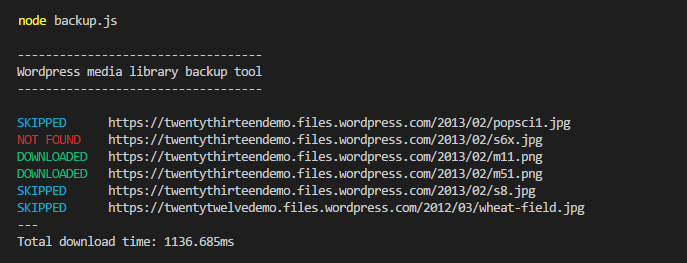

# Wordpress media library backup

Backup tool to export media files from a site hosted on WordPress.com.

WordPress.com offers a free export tool that allows exporting of posts, pages, comments, categories, and (only) metadata of media files. 

This backup tool then takes that XML file as input and downloads all media files referenced in it using the `<wp:attachment_url>` tag. 

The colour-coded processing states are as follows
 - DOWNLOADING: Download has started for the resource at this URL
 - DOWNLOADED: Download has finished
 - SKIPPED: Download for this resource was skipped (the local copy is newer)
 - NOT FOUND: The resource has been deleted on the remote server

The total download time is reported at the end of the backup process.

Here is a sample output



# Installation

To install, run 
```javascript
npm install --save wordpress-media-library-backup-js
```

To run the console application, issue the command
```javascript
node backup.js <xml-file> <destination-directory>
```
